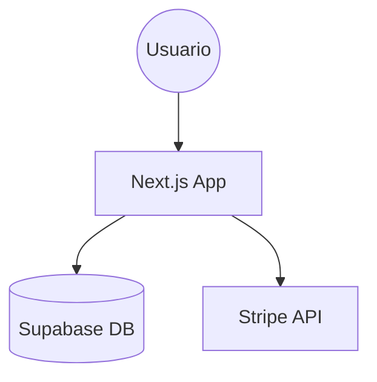

# C4 Architecture Model

El modelo C4 es una forma sencilla de comunicar la arquitectura de software. Es como Google Maps aplicado al código.

## 🗺️ Los 4 Niveles de Diagramación

### Nivel 1: Diagrama de Contexto (Sistema)
- **Zoom**: Vista de pájaro.
- **Muestra**: Tu sistema y cómo interactúa con el mundo exterior (Usuarios, Otros sistemas como Supabase, Stripe, etc.).
- **Público**: Técnicos y No técnicos.

### Nivel 2: Diagrama de Contenedor
- **Zoom**: Dentro del sistema.
- **Muestra**: Aplicaciones web (Next.js), Bases de Datos (PostgreSQL), APIs externas.
- **Público**: Arquitectos y Desarrolladores.

### Nivel 3: Diagrama de Componente
- **Zoom**: Dentro de un contenedor.
- **Muestra**: Features, hooks, servicios y cómo se conectan.
- **Público**: Desarrolladores.

### Nivel 4: Código
- **Zoom**: La implementación real.
- **Muestra**: Clases, interfaces y funciones.

## 🛠️ Herramienta Sugerida: Mermaid.js

Cuando entregues documentación profesional, usa bloques de Mermaid:

## 🏁 Meta-Instrucción
Usa este skill en la fase de **Entrega Profesional** para generar diagramas claros en `EXPLICACION_SISTEMA.md`.
